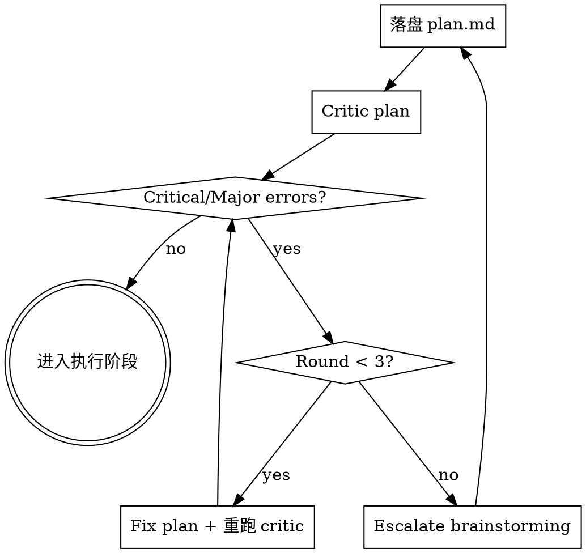
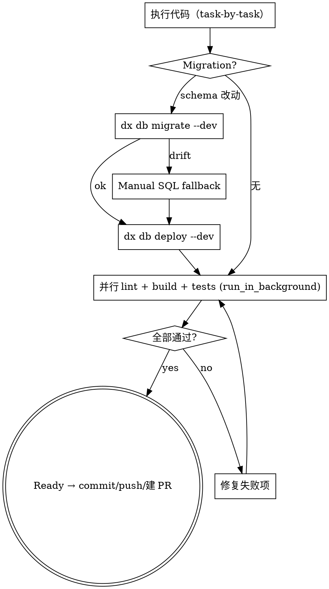

# Feature Decide · Plan · Execute · Push

## Overview

把"一个需求落到 PR 已创建、待审查"这一段流程跑完：**决策（Track A/B/C）→ 写实施计划（含 critic 循环）→ 执行代码 + 并行验证（含修复循环）→ commit → push → 创建 PR**。多 PR 时按依赖顺序完成多个 PR 的提交推送。

**不负责审查与合并**——所有 PR 拿到编号后交给 `pr-train-ship` 跑 review → fix → auto-merge。

本 skill 是 `multi-pr-feature-delivery` 拆出的"前半段（含 PR 创建）"。后半段（审查 + 合并）见 `pr-train-ship`。

## Scope

显式调用本 skill 后，第一步永远是 **Step 0 复杂度评估**，由评估决定后续 Track A / B / C。

适用：

- 一个 issue / 需求从决策落到"PR 已创建"。
- 用户明确要求决定 Track / 写实施计划 / 跑 critic / 执行 + 验证 / commit / push / 建 PR。

**不要用：** 用户未显式调用时不要自动进入；纯讨论 / 纯文档润色 / 单文件 typo 不需要本 skill。

## 输出契约

本 skill 结束时必须输出一个 **PR 清单**，作为给 `pr-train-ship` 的 handoff：

```
[PR Handoff]
模式：单 PR / Train N
PR 列表：
  - PR #1234（feat: schema + writer）— 已 push 待 review
  - PR #1235（feat: consumer + DTO）— 草稿，依赖 #1234，等其 merge 后再 push
Issue: #4774
```

**Train 模式核心约束：本 skill 一次只能 push 当前可独立合并的 PR**。后续 PR 在前 PR merge 到 main 后再切分支 / 实现 / push（由调用方循环本 skill 或由 `pr-train-ship` 完成前 PR 后回调本 skill）。

## Step 0：复杂度评估闸门（必跑，不可跳）

第一件事不是动代码，是对照下表打勾给出 Track 判定。**不允许凭感觉直接进入 Track C，也不允许"看上去简单"跳过 Step 0**。

### 评估维度

| # | 维度 | 计为"复杂"的判据 |
|---|------|-----------------|
| D1 | **改动层数** | 同时改 ≥3 个：Prisma schema / backend service / frontend / admin-front / seed / RBAC / api-contracts |
| D2 | **数据流跨越** | 存在"写入方 → 消费方"两侧改动，且消费方运行期依赖写入方先产生数据（scheduler / cron / 队列消费者 / event handler） |
| D3 | **Schema 变更** | 新增/修改 Prisma 模型（新表、新列、外键、索引），且有运行期消费者 |
| D4 | **新独立模块** | 新建 NestJS module / 新前端 page route / 新 admin 菜单（≥1 个全新顶层目录） |
| D5 | **基建改动** | 改 RBAC enum / ErrorCode / 全局拦截器 / Module DI 拓扑 / 共享 helper（影响多个模块） |
| D6 | **预估改动量** | 按经验估算 diff > 400 行 或 > 8 个文件 |
| D7 | **测试基建** | 需要新增 E2E fixture / 通用 helper 给后续 PR 复用 |
| D8 | **不可逆/高风险** | 数据回填脚本 / 破坏性 migration / 影响生产已有数据 |

### Track 判定

| 命中条数 | Track | 形态 |
|---------|-------|------|
| **0 条** | **Track A — 直接交付** | 不写文档、不分 PR；改完 commit/push/建 PR → `pr-train-ship` 收口 |
| **1-2 条**（且 D2/D3/D8 均未命中） | **Track B — 单 PR + 轻量计划** | 写实施计划（无 spec），critic 一轮，单 PR → `pr-train-ship` |
| **≥3 条** 或 **D2/D3/D8 任一命中** | **Track C — 多 PR train** | 写实施计划 + 严苛 critic（≤3 轮） + 按数据流拆 PR + 按依赖序串行 push PR，每个 PR 交 `pr-train-ship` |

> ⚠️ **D2 / D3 / D8 是"硬升级条件"**：任一命中，无论总命中数多少，必须进 Track C。

### Step 0 输出模板

```
[复杂度评估]
命中维度：D1=Y D2=N D3=N D4=Y D5=N D6=Y D7=N D8=N（共 3 条）
硬升级触发：无
判定：Track C — 多 PR train
预估 PR 数：3（schema+writer / consumer+DTO / frontend）
```

---

## Issue Gate（必跑，不可跳）

任何 Track 在切分支前都必须有 issue ID。先 `gh issue list --search "<keyword>" --state open` 确认；如无则按下表创建。

### Issue 创建时机

| Track | 时机 | 原因 |
|-------|---------|------|
| **A** | Step 0 之后、切分支之前 | 分支命名 `*/<id>-<slug>` 与 commit `Refs/Closes: #<id>` 需 issue ID |
| **B** | 实施计划写完后、plan critic 之前 | issue body "方案"段引用 plan 路径 |
| **C** | PR 拓扑确定后、plan critic 之前 | "方案"段附 PR 拓扑表 + plan 路径 |

### Issue 模板（必含 4 段）

```markdown
## 背景
（为什么做：用户痛点 / 业务目标 / 触发事件，1-3 段）

## 目标
（做完后达成什么可观测结果）

## 方案
（Track A 写 1-2 句；Track B/C 引用 plan 文档路径，可附 PR 拓扑表）

## 验收标准
- [ ] 可勾选 / 可验证的具体项
```

```bash
gh issue create --title "<title>" --body-file - <<'MSG'
## 背景
...
## 目标
...
## 方案
...
## 验收标准
- [ ] ...
MSG
```

已有 issue 但 4 段不全 → `gh issue edit <id> --body-file -` 补齐。**验收标准缺失 = 不允许进入实现阶段**。

---

## Track A：直接执行 + push（简单改动）

**适用：** Step 0 命中 0 条。

**本 skill 内动作：**

1. Issue Gate
2. 切分支 `fix|feat|chore/<id>-<slug>`
3. 修改代码（直接动手，不写 plan）
4. **执行 + 并行验证循环**（见下方）
5. **Commit + Push + 创建 PR**（见下方"PR 创建段"）
6. 输出 PR Handoff → 交 `pr-train-ship`

**禁止：** 写 spec.md / plan.md、跑 plan critic、做 PR 拆分讨论。

---

## Track B：单 PR + 轻量计划（中等改动）

**适用：** Step 0 命中 1-2 条且 D2/D3/D8 均未命中。

**本 skill 内动作：**

1. 落盘实施计划：`docs/superpowers/plans/YYYY-MM-DD-<topic>.md`（不写 spec）
   - 计划结构：Files / Steps / Verify / Commit，粒度 2-5 分钟每 Task
2. Issue Gate（plan 路径写入"方案"段）
3. **Plan critic 循环** 一轮（见下方）
4. 切分支 `feat/<id>-<slug>`，按 plan task-by-task 执行（推荐 `superpowers:subagent-driven-development`）
5. **执行 + 并行验证循环**
6. **Commit + Push + 创建 PR**
7. 输出 PR Handoff → 交 `pr-train-ship`

---

## Track C：多 PR train（复杂改动）

**适用：** Step 0 命中 ≥3 条 或 D2/D3/D8 任一命中。

### C-Step 1：撰写实施计划（不写 spec）

落盘路径：`docs/superpowers/plans/YYYY-MM-DD-<topic>-multi-pr.md`

> ⚠️ 不写 spec.md。信息不够回 `superpowers:brainstorming` 补齐设计，不要靠 spec 兜底。

计划结构：

```markdown
# <功能名> Multi-PR Implementation Plan

**Goal:** 一句话
**Track:** C
**Total PRs:** N
**Issue:** #<id>

## PR 拓扑（按硬依赖拓扑序）

| # | PR 标题 | 涵盖层 | 依赖 PR | 是否需哨兵 |
|---|---------|--------|---------|-----------|
| 1 | feat: schema + writer | Prisma + scheduler | - | 是 |
| 2 | feat: consumer + DTO | service + api-contracts | #1 | 否 |
| 3 | feat: frontend | Next.js | #2 | 否 |

## PR-N Detail（每个 PR 独立一段）

### PR 1: feat: schema + writer
**Files:** Create / Modify 列表
**Tasks:** 每步完整代码、Verify、Commit
**Sentinel:**（如需）哨兵 SQL 查询模板
```

Issue Gate（拓扑表写入"方案"段）。

### C-Step 2：严苛 plan critic（≤3 轮）

派 `oh-my-claudecode:critic`（通过 `Task` / `Agent` 工具）。审核要点：

1. PR 拓扑序是否符合"硬依赖拓扑序"？
2. 是否有 PR 把"写入方 + 消费方"塞进同一个？（违反 D2）
3. Schema PR 是否独立？是否带哨兵 SQL？
4. 每个 PR 是否可独立 review / 合并 / 回滚？
5. Import 路径、Zodios 方法名、DTO 签名是否真实存在
6. 是否遗漏 ErrorCode / Swagger / RBAC / api-contracts / 菜单注册 / Seed
7. 测试基建放在第几个 PR，时序合理否

每轮 critic 落盘 `.omc/plans/<topic>-multi-pr-critic-roundN.md`。

**Hard Gate：** Critical / Major 必修；3 轮仍未过 → escalate 回 `superpowers:brainstorming` 重谈设计。**不允许"接受 minor 妥协"强行通过**。

### C-Step 3：按 PR 序列循环（**本 skill 完成代码 + commit + push + 建 PR**）

对计划中每个 PR，依序：

1. **前置条件检查**：若本 PR 依赖上游 PR（如 PR2 依赖 PR1），**上游 PR 必须已 merge 到 main**。未 merge 则本 skill 不继续，输出"等待 PR-#X merge 后再调用本 skill 继续"提示，结束本次会话。
2. `git checkout main && git pull && git checkout -b feat/<id>-<slug>-pr<n>`
3. 按 PR-N detail 的 Tasks 执行（推荐 `superpowers:subagent-driven-development`）
4. Migration 路径（如有）：`dx db migrate --dev --name X` → 失败走 Manual SQL fallback → `dx db deploy --dev` 验证
5. **执行 + 并行验证循环**（全绿才继续）
6. **如本 PR 是写入侧**：等真实写入路径跑过一次，记录哨兵 SQL 输出（供下一 PR body 用）
7. **Commit + Push + 创建 PR**（PR body 加 `**PR Train:** N/Total`，消费侧贴哨兵 SQL）
8. 输出当前 PR 的 PR Handoff → 交 `pr-train-ship`
9. **等 `pr-train-ship` 完成本 PR（真正 merge 到 main）后，再回到 1 处理下一 PR**

> ⚠️ **本 skill 在一次调用内一般只产出一个"待 ship 的 PR"**（除非多个 PR 之间无依赖且当前 main 已包含所有必需上游变更——这种情况罕见）。Train 串行的核心约束是：**前 PR 真 merge 后才 push 后续 PR**。

---

## 拆解原则（Track C 用）

PR 数量按 issue 实际形态决定（常见 2-6 个）。

**Step 1：列"切面变更"** — Schema / 写入路径 / 读取路径 / 独立子模块 / 客户端 / 管理端 / 基建 / 运营脚本。

**Step 2：识别"硬依赖边界"** —
1. 数据可用性依赖（最强拆分理由）
2. API 契约依赖
3. DI/Module 依赖
4. 测试基建依赖

> ⚠️ 数据流跨越规则优先于行数门槛。"写入方"和"消费方"两侧都改且消费方运行依赖写入方先产生数据 → 必须分 PR。

**Step 3：按"硬依赖拓扑序"排出 PR 序列** — 基础设施在前，叶子在后。

**Step 4：是否需要"等待哨兵"** — 异步写入路径的消费 PR body 必须附可复现查询：

```sql
SELECT count(*) AS rows,
       count(*) FILTER (WHERE <new_column> IS NOT NULL) AS populated,
       max(<updated_at_column>) AS last_run
FROM <new_or_extended_table>
WHERE <time_filter_matching_writer_cadence>;
```

---

## Plan Critic 循环（Track B / C）



**Track B：** 一轮 critic 即可。**Track C：** 严苛 critic ≤3 轮，超限必须 escalate。

每轮 critic artifact 落盘 `.omc/plans/<topic>-critic-roundN.md`，PR body 引用。

## Critic 决策矩阵

| 严重级 | 默认决策 | 例外 |
|--------|---------|------|
| **Critical** | 必修 | 无 |
| **Major** | 修，除非有书面 out-of-scope 理由 | 转 follow-up issue |
| **Minor** | 修复 if < 5 行；否则附理由拒绝 | 不接受"超出本 PR 范围"作为唯一理由 |
| **What's Missing** | 转 follow-up issue 或纳入拒绝理由 | 历史遗留需明示 |

---

## 执行 + 并行验证循环（所有 Track 共用）



### 并行 Verify（不允许串行）

```bash
# 三个独立 run_in_background Bash 调用
# dx lint
# dx build affected --dev   （或直接 dx build <target> --dev）
# dx test unit/e2e 按改动范围

# 优先用 SYSTEM 自动通知（每个 background 完成时 task-notification 到达）
# 不要写本地 pgrep 等待循环
```

兜底（仅在通知不可用时）：

```bash
deadline=$(($(date +%s) + 1800))
until [ -z "$(pgrep -f 'nx (lint|build|test|run-many|affected)' 2>/dev/null)" ]; do
  [ "$(date +%s)" -ge "$deadline" ] && { echo "TIMEOUT"; exit 1; }
  sleep 5
done
```

> **为什么不能串行**：lint 失败时 build/test 仍提供独立信号；串行会屏蔽后续问题，增加 fix-rebuild-rerun 循环。3 信号并发 = 单次循环修干净所有维度。

### 验证失败修复循环

任一信号失败 → 修复 → **重跑全部三路**（不允许只重跑失败那一路）→ 直到全绿。

修复轮数无硬上限，但出现以下必须停下来重审：

- 同一类错误连续 3 次修复仍出现 → 设计问题，回 plan critic 或 `superpowers:brainstorming`
- 修一个错引入两个新错 → 同上

## Manual Migration Fallback

`dx db migrate --dev --name X` 报 "dev DB drift / reset" 时：

```bash
TS=$(date -u +%Y%m%d%H%M%S)
mkdir -p apps/backend/prisma/schema/migrations/${TS}_<name>

# 手写 migration.sql（参考已存在的 migration 文件抄格式）

dx db deploy --dev
dx db generate
pnpm type-check:backend
```

> 📝 `dx db reset --dev` 是 dev 环境合法但最后手段操作。优先：Manual SQL → `dx db migrate --dev --name X` → reset（与队友确认后）。生产 / staging reset 禁止。

---

## PR 创建段（所有 Track 共用 · 验证全绿后执行）

### 1. Commit

```bash
git add -A
git diff --cached --stat
git commit -F - <<'MSG'
<type>: <概要>

变更说明：
- <改动点 1：做了什么 + 为什么>
- <改动点 2>

Refs: #<issue-id>
MSG
```

多 commit 的复杂 PR：按"一个逻辑改动一个 commit"组织，PR 合并时 `--squash` 会折叠。

### 2. Push

```bash
git push -u origin HEAD
```

### 3. 合并冲突检测

```bash
git fetch origin main
git merge --no-commit --no-ff origin/main
```

- 无冲突 → `git merge --abort` 撤回，继续 4
- 有冲突 → `git merge --abort` → `git merge origin/main` 解冲突 → commit `merge: 解决与 main 的冲突` → push

### 4. 收集变更分析

```bash
git log origin/main..HEAD --oneline
git diff origin/main...HEAD --stat
git diff origin/main...HEAD
```

### 5. 创建 PR

PR 描述必须让 reviewer 不看代码就能理解改动目的：

```bash
gh pr create --base main \
  --title "<type>: <概要>" \
  --body-file - <<'MSG'
**PR Train:** N/Total（依赖 #prev-pr-num）   <!-- 仅 Track C 加这行 -->

## 变更目的

[为什么做这个改动，解决了什么问题]

## 主要改动

### [模块/文件组 1]
- [改动描述：做了什么 + 为什么]

### [模块/文件组 2]
- [改动描述]

## 影响范围

- **API 变更**：[有/无，列端点]
- **数据库变更**：[有/无，说明迁移]
- **向后兼容**：[是/否，说明破坏点]

## 验证情况

- [x] 本地 lint / build / 关联测试通过
- [ ] 待 CI 验证项

## 哨兵 SQL（消费侧 PR 必填，其余可省）

```sql
SELECT count(*) ... FROM ...;
-- 输出：rows=128, populated=128, last_run=2026-05-19 08:00:00
```

## 关联

Closes: #<issue-id>   <!-- 末 PR 用 Closes；中间 PR 用 Refs -->
MSG
```

记录返回的 PR 编号。

### 6. 输出 PR Handoff

```
[PR Handoff]
模式：Track <A/B/C>，<N>/<Total>
当前 PR：#<num> <标题> — 已 push 待 review
Issue: #<id>
建议下一步：调用 pr-train-ship --pr <num> 进入审查→合并流程
```

---

## Hard Gates（不可跳过）

1. **Track 闸门** — Step 0 必须输出 Track 判定后才进入。
2. **Issue Gate** — 切分支前必须有 issue + 4 段齐全；验收标准缺失 = 不允许实现。
3. **Plan critic gate**（B / C）— 没通过 plan critic 不得进入执行。
4. **PR0 哨兵 gate**（C 且涉及异步写入）— 写入侧真实跑过一次后，消费侧 PR body 必须贴 SQL 证据。
5. **Critic 上限**（C）— plan critic ≤3 轮，超限必须 escalate `superpowers:brainstorming`。
6. **验证未全绿不创建 PR** — 三路并行验证全部 exit 0 才能 commit/push/建 PR。
7. **Train 依赖串行 gate**（C）— 本 PR 依赖的上游 PR 必须已 merge 到 main 才能切本 PR 分支。
8. **不越界做审查/合并** — 本 skill **禁止** `gh pr comment` 发审核报告 / `gh pr merge`。审查 + 合并全部交 `pr-train-ship`。
9. **Heredoc gate** — commit / PR body / Issue body 多行内容必须 heredoc，禁止 `-m "...\n..."`。
10. **不在 main commit** — 必须先切分支。

## Quick Reference

| 操作 | 命令 |
|------|------|
| 查 issue | `gh issue list --search "<keyword>" --state open` |
| 创建 issue | `gh issue create --title "..." --body-file - <<'MSG' ... MSG` |
| 补全 issue | `gh issue edit <id> --body-file - <<'MSG' ... MSG` |
| 切分支 | `git checkout main && git pull && git checkout -b feat/<id>-<slug>` |
| Critic plan | `Task` / `Agent` tool with `subagent_type: oh-my-claudecode:critic` |
| 手动迁移目录 | `mkdir -p apps/backend/prisma/schema/migrations/$(date -u +%Y%m%d%H%M%S)_<name>` |
| 应用迁移 | `dx db deploy --dev` |
| 并行 verify | 三个 `run_in_background` Bash 分别跑 `dx lint` / `dx build ... --dev` / `dx test ...` |
| 冲突检测 | `git fetch origin main && git merge --no-commit --no-ff origin/main` |
| 创建 PR | `gh pr create --base main --title "..." --body-file - <<'MSG' ... MSG` |
| 检查依赖 PR 是否已 merge | `gh pr view <num> --json mergedAt` |

## Common Mistakes

| 错误 | 加固 |
|------|------|
| 跳过 Step 0 凭感觉判定 Track | Hard Gate 1 |
| 没 issue 直接切分支 | Hard Gate 2 |
| Issue 只有标题就当合格 | 4 段必须齐全，验收标准必须可勾选 |
| Track B/C 在写 plan 之前先建 issue | 时序错：issue "方案"段要引用 plan 路径 |
| "只是加一个字段" 跳过 Track C | D3 硬升级，schema 改动一律进 C |
| Schema diff 当 plan | Plan 含拓扑序、哨兵、import 路径、Verify |
| 串行 lint→build→test | 并行 3 路 |
| 第一反应 `dx db reset --dev` | reset 是最后手段 |
| 第 3 轮 critic 仍未过强行 minor 妥协 | 必须 escalate brainstorming |
| 验证只跑一路就 push | 三路全绿才能 push |
| 本 skill 内部 `gh pr comment` 发审核 | Hard Gate 8：审查交 `pr-train-ship` |
| 本 skill 内部 `gh pr merge` | 同上 |
| Track C 上游 PR 还没 merge 就 push 下游 | Hard Gate 7：依赖串行 |
| commit / PR body 用 `\n` 字面量 | Hard Gate 9：必须 heredoc |
| 一次会话内 push 多个有依赖关系的 PR | 每次只 push 一个，等其 merge 后再继续 |
| 同一类错连修 3 次仍出现 | 回 plan critic 或 brainstorming |

## Tie-In With Other Skills

- `superpowers:brainstorming` — 设计阶段；critic escalate 时回到此
- `superpowers:subagent-driven-development` — task-by-task 执行推荐工具
- `pr-train-ship` — 本 skill 输出 PR 编号后的下游：审查 + 合并
- `oh-my-claudecode:critic` agent — 通过 `Task` / `Agent` 工具调度
