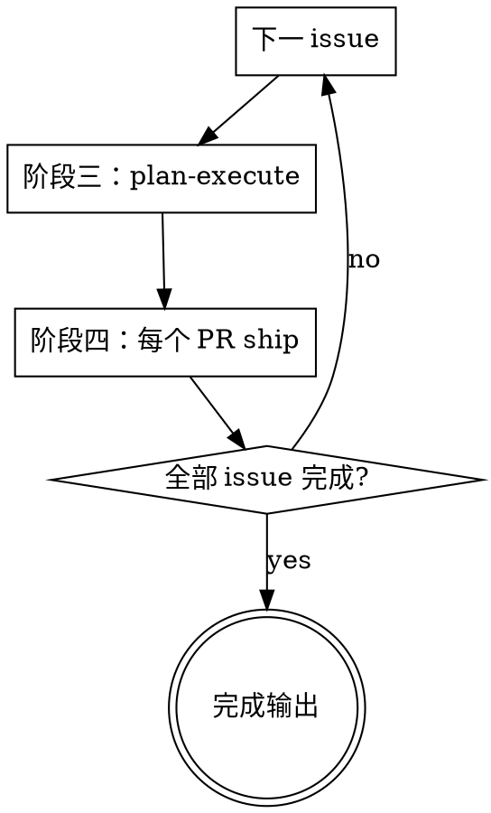

# Issues Batch Deliver — 批量 Issue 编排器

## Overview

接收**一个或一串 issue ID**，逐个 issue 派 subagent 调用 `feature-decide-plan-execute` 把代码 + PR 创建出来；再按返回的 PR 列表（含依赖关系）派 subagent 调用 `pr-train-ship` 把每个 PR ship 到 main。**每次 subagent 返回后必须做"事实校验"**——claim 与实际仓库 / GitHub 状态不一致就重新派发（带上诊断信息），重试有上限。

## 角色定位

```
issues-batch-deliver  (本 skill — 编排器 / 主 agent)
        │
        ├─ 对每个 issue 派 subagent → feature-decide-plan-execute → 产出 PR 编号
        │       └─ 校验：PR 真的存在？分支真的 push 了？验证真的全绿？
        │
        └─ 对每个 PR 派 subagent → pr-train-ship → 真合并到 main
                └─ 校验：mergedAt 真的非空？审查 comment 真的发了？
```

主 agent 只做：派发 → 校验 → 重试 → 推进。**不直接动代码、不直接改 issue/PR**。

## Scope

显式调用才进入。

**输入：**

```
$issues-batch-deliver --issues 4774,4823,4901
$issues-batch-deliver --issues 4774                   # 单 issue 也走本流程
$issues-batch-deliver                                  # 从当前对话上下文提取（明确列出后再确认）
```

**前提：**

- 每个 issue ID 在 GitHub 上真实存在且 `state=open`
- 仓库已配置好 `dx` / `gh` CLI / SSH 认证

**不要用：**

- 单 issue 且用户希望自己看每一步 → 直接用 `feature-decide-plan-execute` + `pr-train-ship`
- 纯调研 / 纯讨论 / 不涉及 PR 交付

## 执行原则

- 全程中文输出。
- **事实校验优先**：subagent 说"完成了"不算数，必须 `gh` / `git` 实际查到才认。
- **重试有上限**：同一 issue 的 plan-execute 重试 ≤ 2 次；同一 PR 的 ship 重试 ≤ 2 次；超限 escalate 给用户。
- **Issue 之间默认串行**（避免一次开太多 WIP 干扰 dev DB / branch 切换）；用户明确允许并行才并行。
- **PR 之间按依赖串行**：依赖 PR `mergedAt` 非空才能开下游。
- 不绕过下游 skill 的 Hard Gate：本 skill 是编排，不允许"为了赶进度跳 critic / 跳双 comment / `--admin` 合并"。

---

## 阶段一：输入解析与预检

### 1.1 解析 issue 列表

```bash
ISSUES="4774,4823,4901"
IFS=',' read -ra IDS <<< "$ISSUES"
```

### 1.2 逐个预检

对每个 `id` 跑：

```bash
gh issue view $id --json number,title,state,body,labels --jq '{n:.number, t:.title, s:.state, has_acceptance: (.body | contains("验收标准"))}'
```

校验：

- `state == "OPEN"`
- body 含"验收标准"段（4 段齐全的简单代理判据）
- 无以上 → 输出"Issue #X 缺验收标准 / 已关闭，跳过 / 终止"，请用户确认或修复

### 1.3 输出执行计划

```
[Batch Plan]
共 3 个 issue 串行执行：
  1. #4774 - <title>
  2. #4823 - <title>
  3. #4901 - <title>
重试上限：plan-execute 2 次 / ship 2 次
```

---

## 阶段二：Issue 循环

对每个 issue 依序执行**阶段三 + 阶段四**。前一 issue 全部 PR 都 merge 到 main 后再开下一 issue。



---

## 阶段三：派 plan-execute subagent

### 3.1 派发

为当前 `issue_id` 派一个 subagent，独立上下文、独立工作树（可选 worktree）：

Subagent prompt 模板：

```
你是 feature-decide-plan-execute skill 的执行者。

任务：处理 issue #<id>，完成从决策到 PR 创建的全部动作。

必须遵循 feature-decide-plan-execute skill 的所有 Hard Gate：
- Step 0 复杂度评估必须先输出 Track 判定
- Issue Gate（#<id> 已存在，验证 4 段齐全；缺则 gh issue edit 补齐）
- Track B/C：plan critic ≤3 轮
- 执行 + 并行验证（lint/build/test 三路全绿）
- commit / push / gh pr create
- Train 串行：依赖 PR 未 merge 时只 push 当前可推进的那个 PR

【重要】禁止调用 pr-train-ship、禁止 gh pr comment 发审核报告、禁止 gh pr merge。

返回格式（严格 JSON，作为最后一段输出）：
{
  "issue": <id>,
  "track": "A" | "B" | "C",
  "total_prs_planned": <number>,
  "prs_pushed_this_session": [
    {"number": <PR#>, "title": "...", "depends_on": <PR#|null>, "is_consumer": <bool>}
  ],
  "prs_pending": [
    {"slug": "...", "depends_on": <PR#>, "reason": "上游未 merge"}
  ],
  "plan_path": "docs/superpowers/plans/...md" | null,
  "verification": {"lint": "pass", "build": "pass", "tests": ["..."]}
}
```

### 3.2 事实校验（subagent 返回后立即跑）

不要相信 subagent 自报，直接查 GitHub / git：

```bash
# 校验 1：声称 push 的 PR 真存在且 OPEN
for pr in $(echo "$result" | jq -r '.prs_pushed_this_session[].number'); do
  state=$(gh pr view $pr --json state --jq .state)
  [ "$state" = "OPEN" ] || echo "FAIL: PR #$pr state=$state"
done

# 校验 2：PR body 含正确的 issue 关联
for pr in $(echo "$result" | jq -r '.prs_pushed_this_session[].number'); do
  body=$(gh pr view $pr --json body --jq .body)
  echo "$body" | grep -qE "(Closes|Refs): #<id>" || echo "FAIL: PR #$pr 缺 issue 关联"
done

# 校验 3：消费侧 PR 必须有哨兵 SQL
for pr in $(echo "$result" | jq -r '.prs_pushed_this_session[] | select(.is_consumer==true) | .number'); do
  body=$(gh pr view $pr --json body --jq .body)
  echo "$body" | grep -q "哨兵 SQL\|sentinel" || echo "FAIL: 消费侧 PR #$pr 缺哨兵证据"
done

# 校验 4：PR 拓扑与 plan 一致（Track C）
# 读 plan_path 文件，对比 prs_pushed + prs_pending 数量是否等于拓扑表总数

# 校验 5：本地是否真的全绿——派一个轻量 subagent 跑一次 dx lint + 受影响 build
# （可选，subagent 已声称跑过；抽查避免捏造）
```

### 3.3 失败重新派发

任一校验失败 → 计数 `retry_plan_execute += 1`：

- `retry < 2`：派**同一**任务的新 subagent，prompt 附加诊断：
  ```
  上一次执行存在以下问题，请修复后重新交付：
  - PR #<n> body 缺 Closes: #<id> 关联
  - 消费侧 PR #<n> 缺哨兵 SQL 段
  - ...

  当前仓库状态：
  - 分支 <branch> 已存在并 push（不要重复创建）
  - PR #<n> 已创建（继续在该 PR 上 edit body / push 增量 commit）
  ```
- `retry >= 2`：停止本 issue，输出 escalation 报告给用户决断

校验全通过 → 进入阶段四。

---

## 阶段四：派 pr-train-ship subagent（按依赖序）

### 4.1 拓扑排序

把 `prs_pushed_this_session` 按 `depends_on` 拓扑排序。同 issue 内有依赖的 PR 在 `feature-decide-plan-execute` 阶段一般只 push 了最上游的；下游 PR 在 `prs_pending` 中。

### 4.2 串行 ship 循环

对拓扑序中的每个 PR：

**派发**（独立 subagent）：

```
你是 pr-train-ship skill 的执行者。

任务：对 PR #<n>（issue #<id> 的第 <k>/<total> 个 PR）执行完整 ship 流程。

必须遵循 pr-train-ship skill 的所有 Hard Gate：
- Train 依赖检查（依赖 PR mergedAt 非空才继续）
- 合并冲突检测 + 解冲突
- 双源审查 ≤3 轮（裸 subagent，禁用 code-review 技能 / code-reviewer agent）
- 双 comment（审核报告 + 修复报告 分开发）
- 修复 commit 一问题一 commit
- 验证总结报告
- gh pr merge --squash --auto
- 监控 mergedAt 真合并

【重要】只在 PR #<n> 上动作；禁止改其他 PR / 创建新 PR / 调用 feature-decide-plan-execute。

返回格式（严格 JSON）：
{
  "pr": <n>,
  "review_rounds": <int>,
  "issues_found": {"critical": a, "major": b, "minor": c},
  "fixed": <int>,
  "rejected": <int>,
  "merged_at": "<ISO ts>" | null,
  "blocked_reason": "<text>" | null
}
```

**事实校验**（subagent 返回后）：

```bash
# 校验 1：真合并
merged=$(gh pr view $pr --json mergedAt --jq .mergedAt)
[ "$merged" != "null" ] && [ -n "$merged" ] || echo "FAIL: PR #$pr 未真合并"

# 校验 2：双 comment 都发了（每轮）
comments=$(gh pr view $pr --json comments --jq '.comments[].body')
echo "$comments" | grep -q "审核报告（第" || echo "FAIL: 缺审核报告"
echo "$comments" | grep -q "修复报告（第" || echo "FAIL: 缺修复报告"
echo "$comments" | grep -q "✅ 验证总结" || echo "FAIL: 缺验证总结"

# 校验 3：审查轮数声明与 PR comments 实际轮数一致
declared_rounds=$(echo "$result" | jq -r '.review_rounds')
actual_rounds=$(echo "$comments" | grep -c "审核报告（第")
[ "$declared_rounds" = "$actual_rounds" ] || echo "FAIL: 轮数不符 declared=$declared_rounds actual=$actual_rounds"

# 校验 4：合并方式确认（squash + auto）
# 注意：merge 后只能从 commit 历史推断；记录 PR 的 mergedAt 即可作为通过判据
```

**失败重新派发**：

任一校验失败或 `merged_at == null` 且 `blocked_reason` 非"auto-merge 等待中" → `retry_ship += 1`：

- `retry < 2` 且 `blocked_reason` 是可恢复（冲突 / lint / 审查未发评论）→ 派同一 PR 的新 subagent，prompt 附诊断：
  ```
  上次 ship 存在以下问题，请继续完成（不要重启流程，从未完成处续）：
  - PR comment 中找不到第 3 轮审核报告（subagent 声称跑了 3 轮）
  - PR 仍 OPEN，mergedAt=null，CI 红：...

  当前 PR 状态：
  - branch=<branch>，HEAD=<sha>
  - 已发的 comments：第 1 轮审核+修复 / 第 2 轮审核+修复
  - 接下来应该：第 3 轮审查或直接最终验证 + 验证总结 + auto-merge
  ```
- `retry >= 2` 或 `blocked_reason` 不可恢复（required reviewer 未 approve / branch protection 缺签名）→ 停止本 PR，输出 escalation

**Auto-merge 等待**：

`gh pr merge --squash --auto` 已设但 `mergedAt` 仍为 null：

```bash
# 监控（建议用 Monitor 工具或 ScheduleWakeup 而不是同步轮询）
gh pr view $pr --json state,mergedAt,mergeStateStatus,statusCheckRollup
# Stuck > 30 min → 主 agent 介入：检查 mergeStateStatus（BLOCKED / DIRTY / UNSTABLE）
```

### 4.3 上游 merge 后回填下游

若本 issue 的 `prs_pending` 中有依赖刚 merge PR 的项 → **回到阶段三**，再派一次 `feature-decide-plan-execute` subagent，prompt 注明：

```
任务：继续 issue #<id> 的 Track C train，处理下一个 PR <slug>。
依赖 PR #<prev> 已 merge（mergedAt=<ts>），现在可以切下游分支。
plan 文档：docs/superpowers/plans/...md（已存在，按其中 PR-<k> Detail 执行）
```

**不要在主 agent 内自行切下游分支** — 仍走 subagent + plan-execute skill 路径，保持职责单一。

---

## 阶段五：Issue 完成判定与推进

当前 issue 所有 PR（含 pending → pushed → merged）都 `mergedAt` 非空 → 当前 issue 完成。

```bash
# 校验 issue 在 GitHub 上被自动关闭（末 PR 含 Closes: #<id>）
gh issue view $id --json state --jq .state
# 应为 CLOSED；若仍 OPEN → 末 PR 的 Closes: 关联可能写错，输出告警让用户检查
```

进入下一 issue（回阶段二）。

---

## 阶段六：完成输出

```
Batch Deliver 完成！

| Issue | Track | PRs | 状态 |
|-------|-------|-----|------|
| #4774 | C | #1234, #1235, #1236 | ✓ 全部合并 |
| #4823 | A | #1240 | ✓ 已合并 |
| #4901 | B | #1245 | ⚠ ship 重试 2 次仍 BLOCKED，需人工 |

总计：发出 plan-execute subagent X / ship subagent Y / 重试 Z
```

---

## 重试与 Escalation 矩阵

| 失败类型 | 自动重试 | 重试时附带的诊断 | Escalation 条件 |
|---------|---------|----------------|----------------|
| plan-execute 校验失败（PR body / 哨兵 / 关联） | ≤ 2 次 | 列出每条失败校验 + 当前仓库状态 | 2 次仍失败 → 输出给用户 |
| plan-execute 验证未全绿 | ≤ 2 次 | lint/build/test 失败摘要 | 同上 |
| ship 双 comment 缺失 | ≤ 2 次 | 实际 comment 列表 vs 预期 | 同上 |
| ship 合并冲突 | ≤ 2 次 | 冲突文件列表 | 同上 |
| ship CI 红 | ≤ 2 次 | CI 失败步骤 | 同上 |
| Auto-merge stuck > 30 min | 不重试 | mergeStateStatus | 立即给用户 |
| required reviewer 未 approve | 不重试 | reviewer 列表 | 立即给用户 |
| branch protection 缺签名 | 不重试 | required signatures 列表 | 立即给用户 |
| issue 不存在 / 已关闭 | 不重试 | issue state | 立即给用户 |

---

## Hard Gates（不可跳过）

1. **事实校验 gate** — subagent 自报完成不算，必须 `gh` / `git` 实际查到才推进。
2. **重试上限 gate** — 同一 plan-execute / ship 最多 2 次重试，超限必须 escalate。
3. **依赖串行 gate** — PR 间按 `depends_on` 拓扑串行；上游 `mergedAt` 非空才派下游。
4. **Issue 串行 gate**（默认）— 前一 issue 全 PR 合并才开下一 issue。用户明确允许并行才并行。
5. **不绕过下游 Hard Gate** — 本 skill 是编排，禁止"为赶进度跳 critic / 跳双 comment / `--admin` 合并"。失败必须重试或 escalate。
6. **角色单一 gate** — 主 agent 只派发 + 校验 + 推进；禁止主 agent 直接 commit / push / 发 PR comment / merge。所有动作走 subagent + 下游 skill。
7. **诊断附带 gate** — 重试派发时**必须**附带"上次失败原因 + 当前仓库状态"，不允许裸重试。
8. **Auto-merge 真合并 gate** — `mergedAt` 非空才算 ship 完成；只设 `--auto` 不监控 = 未完成。

---

## Quick Reference

| 操作 | 命令 |
|------|------|
| 预检 issue | `gh issue view <id> --json number,title,state,body` |
| 派 plan-execute subagent | `Task` / `Agent` tool（独立上下文，prompt 强制走 feature-decide-plan-execute） |
| 派 ship subagent | `Task` / `Agent` tool（独立上下文，prompt 强制走 pr-train-ship） |
| 校验 PR 存在 | `gh pr view <num> --json state` |
| 校验 PR 含 issue 关联 | `gh pr view <num> --json body \| grep -E "(Closes\|Refs): #<id>"` |
| 校验双 comment 已发 | `gh pr view <num> --json comments` |
| 校验真合并 | `gh pr view <num> --json mergedAt --jq .mergedAt` |
| 监控 auto-merge | `Monitor` tool with `gh pr view ... --json state,mergedAt,mergeStateStatus` |
| 查 issue 是否自动关闭 | `gh issue view <id> --json state` |

## Common Mistakes

| 错误 | 加固 |
|------|------|
| 相信 subagent 自报"完成"直接推进 | Hard Gate 1：必须 gh/git 实际查 |
| 重试不附诊断信息让 subagent 裸跑 | Hard Gate 7：诊断 + 当前状态必备 |
| 重试无上限死循环 | Hard Gate 2：最多 2 次 |
| 上游 PR 未 merge 就派下游 ship | Hard Gate 3：依赖串行 |
| 多 issue 并行干扰 dev DB | Hard Gate 4：默认串行 |
| 主 agent 自己 `gh pr comment` 发审核 | Hard Gate 6：必须走 subagent + pr-train-ship |
| 主 agent 自己 `gh pr merge` | 同上 |
| 设了 `--auto` 没监控就声称完成 | Hard Gate 8：必须 mergedAt 非空 |
| ship subagent 在 PR 上跑越权动作（建新 PR / 改其他 PR） | subagent prompt 显式约束作用域 |
| plan-execute subagent 自己直接调 pr-train-ship | subagent prompt 显式约束「禁止调用 pr-train-ship」 |
| auto-merge stuck 仍重试 ship | 不可恢复类失败立即 escalate |
| 末 PR 漏写 Closes: #<id> 导致 issue 不自动关 | 阶段五校验 issue.state，告警让用户检查 |

## Tie-In With Other Skills

- `feature-decide-plan-execute` — 阶段三派发的下游 skill（决策 + plan + 执行 + push + 建 PR）
- `pr-train-ship` — 阶段四派发的下游 skill（审查 + 修复 + 合并）
- `superpowers:dispatching-parallel-agents` — issue 间用户允许并行时的派发参考
- `Monitor` / `ScheduleWakeup` 工具 — auto-merge 等待场景用，避免同步轮询

## Subagent Prompt Library

### plan-execute prompt（阶段三）

完整模板见阶段 3.1。要点：

- 显式声明走 `feature-decide-plan-execute` 全部 Hard Gate
- 禁止调用 `pr-train-ship` / `gh pr comment` 发审核 / `gh pr merge`
- 强制 JSON 返回格式（便于主 agent 解析校验）

### ship prompt（阶段四）

完整模板见阶段 4.2。要点：

- 显式声明走 `pr-train-ship` 全部 Hard Gate
- 作用域限定在指定 PR，禁止改其他 PR / 建新 PR / 调 `feature-decide-plan-execute`
- 强制 JSON 返回格式

### 重试 prompt 附加段（阶段 3.3 / 4.2 失败后）

```
【重试上下文】这是第 <N> 次尝试。

上次失败原因：
- <具体 1>
- <具体 2>

当前仓库 / GitHub 真实状态（已校验）：
- 分支 <branch>：existed=<bool>，HEAD=<sha>
- PR #<n>：state=<...>，merged=<...>，comments 已发：[...]

请从未完成处续做，不要重启流程。不要重复已经做过的步骤。
```
