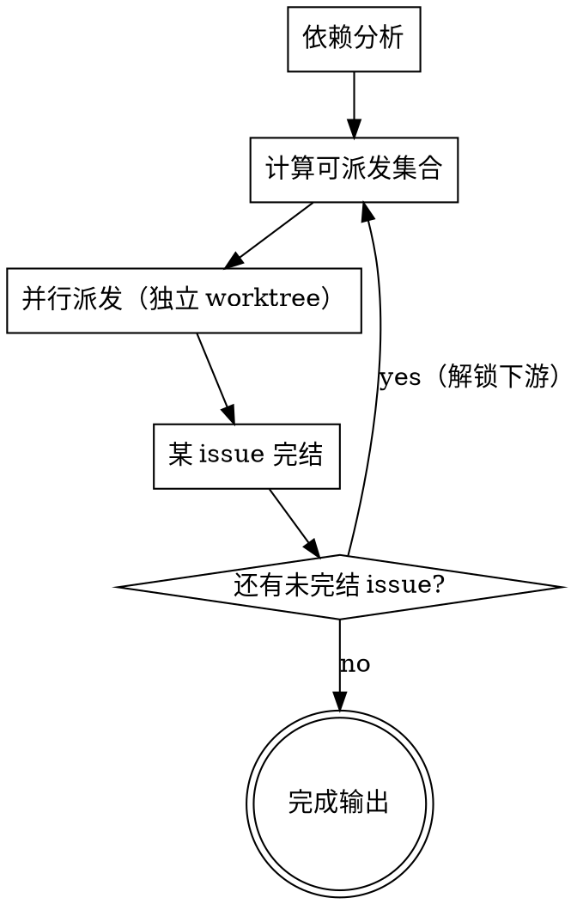

# Issues Batch Deliver — 批量 Issue 编排器

## Overview

接收**一个或一串 issue ID**，逐个 issue 派 subagent 调用 `feature-decide-plan-execute` 把代码 + PR 创建出来；再按返回的 PR 列表（含依赖关系）派 subagent 调用 `pr-train-ship` 把每个 PR ship 到 main。**每次 subagent 返回后必须做"事实校验"**——claim 与实际仓库 / GitHub 状态不一致就重新派发（带上诊断信息），重试有上限。

## 角色定位

```
issues-batch-deliver  (本 skill — 编排器 / 主 agent)
        │
        ├─ 对每个 issue 派 subagent → feature-decide-plan-execute → 产出 PR 编号
        │       └─ 校验：PR 真的存在？分支真的 push 了？验证真的全绿？
        │
        └─ 对每个 PR 派 subagent → pr-train-ship → 真合并到 main
                └─ 校验：mergedAt 真的非空？审查 comment 真的发了？
```

主 agent 只做：**依赖分析 → 并行派发（独立 worktree）→ 校验 → 重试 → 推进**。不直接动代码、不直接改 issue/PR。**绝大多数决策主 agent 自行做，不在派 subagent 前找用户确认**——只有遇到不可恢复失败（escalation）才回报用户。

## Scope

显式调用才进入。

**输入：**

```
$issues-batch-deliver --issues 4774,4823,4901
$issues-batch-deliver --issues 4774                   # 单 issue 也走本流程
$issues-batch-deliver                                  # 从当前对话上下文提取 issue 列表，主 agent 自行确认后直接执行
```

**前提：**

- 每个 issue ID 在 GitHub 上真实存在且 `state=open`
- 仓库已配置好 `dx` / `gh` CLI / SSH 认证

**不要用：**

- 单 issue 且用户希望自己看每一步 → 直接用 `feature-decide-plan-execute` + `pr-train-ship`
- 纯调研 / 纯讨论 / 不涉及 PR 交付

## 执行原则

- 全程中文输出。
- **事实校验优先**：subagent 说"完成了"不算数，必须 `gh` / `git` 实际查到才认。
- **重试有上限**：同一 issue 的 plan-execute 重试 ≤ 2 次；同一 PR 的 ship 重试 ≤ 2 次；超限 escalate 给用户。
- **Issue 之间默认并行**：每个 issue 在**独立 worktree** 派 subagent，互不干扰 branch / 文件。无需逐 issue 找用户确认——主 agent 自行决策派发。
- **有依赖的 issue 串行**：依赖关系（issue body / label 标注 `depends on #X` / `blocked by #X`，或输入显式给出）存在时，**先处理被依赖（上游）issue**，blocked issue 等上游完结后再派。无依赖的 issue 一律并行。
- **PR 之间按依赖串行**：依赖 PR `mergedAt` 非空才能开下游（同 issue 内 Track C train，不变）。
- 不绕过下游 skill 的 Hard Gate：本 skill 是编排，不允许"为了赶进度跳 critic / 跳双 comment / `--admin` 合并"。

---

## 脚本约定（先读这节，后面所有校验都依赖它）

### 变量都是真 shell 变量，不是占位符

后文脚本里 `$id`（当前 issue 号）、`$pr`（当前 PR 号）、`$result`（subagent 返回的 JSON）**全是真 shell 变量**。subagent 复制脚本前必须先赋值（`id=4774`），**严禁保留 `<id>` / `<n>` 字面量**——保留字面量会让 `grep` 永远匹配不到，触发假失败重试。

### `$result` 的来源

每次 subagent 返回后，主 agent 把它最后一段严格 JSON 存进变量，校验全部基于它：

```bash
# 主 agent 从 subagent 返回文本里截取最后一段 JSON，赋给 result
result='<subagent 返回的 JSON>'
echo "$result" | jq . >/dev/null || { echo "subagent 未返回合法 JSON → 直接重新派发"; }
```

JSON 不合法本身就是一种失败，按对应阶段的「失败重新派发」处理，无需落盘。

### 校验聚合：所有 FAIL 必须汇总判定，不允许只 echo

每段校验开头 `FAILS=()`，命中失败 `FAILS+=("...")`，末尾统一判定：

```bash
if [ ${#FAILS[@]} -gt 0 ]; then
  printf '校验失败:\n'; printf '  - %s\n' "${FAILS[@]}"   # → 进入「失败重新派发」
else
  echo "校验全通过"
fi
```

### 诊断采集（重试 prompt 的"当前仓库状态"从这里来）

Hard Gate 7 要求重试必附"当前真实状态"。重新派发前主 agent 跑这组命令，把输出填进重试 prompt：

```bash
branch=$(gh pr view "$pr" --json headRefName --jq .headRefName 2>/dev/null)
head_sha=$(gh pr view "$pr" --json headRefOid --jq .headRefOid 2>/dev/null)
pr_state=$(gh pr view "$pr" --json state,mergedAt,mergeStateStatus --jq '[.state,.mergedAt,.mergeStateStatus]|@tsv' 2>/dev/null)
sent_comments=$(gh pr view "$pr" --json comments --jq '[.comments[].body | scan("审核报告（第|修复报告（第|✅ 验证总结")] | join(", ")' 2>/dev/null)
```

> 不做 checkpoint / resume：subagent 失败就带诊断重新派发即可（重试有上限）。**只对关键点做事实校验**——PR 真存在、真合并、双 comment 真发、本地真全绿——其余轻信 subagent 自报。

---

## 阶段一：输入解析与预检

### 1.1 解析 issue 列表

```bash
ISSUES="4774,4823,4901"
IFS=',' read -ra IDS <<< "$ISSUES"
```

### 1.2 逐个预检

对每个 `id` 跑：

```bash
gh issue view $id --json number,title,state,body,labels --jq '{n:.number, t:.title, s:.state, has_acceptance: (.body | contains("验收标准"))}'
```

校验：

- `state == "OPEN"`
- body 含"验收标准"段（4 段齐全的简单代理判据）
- 无以上 → 输出"Issue #X 缺验收标准 / 已关闭，跳过 / 终止"，请用户确认或修复

### 1.3 依赖分析（主 agent 自行完成，不问用户）

从每个 issue 的 body / labels 以及输入参数里提取依赖关系：

- 关键词：`depends on #X` / `blocked by #X` / `需先完成 #X` / `基于 #X` / label `blocked`
- 构建依赖图：被依赖的 issue（上游）排在前，blocked issue 排在后。
- 无依赖关系的 issue **互相独立**，归入同一并行批次。
- 有依赖的：上游先派；下游标记 `blocked_by=[...]`，上游全部完结后才进入可派发集合。

判定规则（主 agent 直接决策，**不找用户确认**）：

- 检测到环依赖（A→B→A）→ 这是唯一必须 escalate 的情况：输出环路给用户，请求拆解。
- 依赖指向的 issue 不在本批次且未合并 → 标记该下游为 blocked，输出告警，先并行跑可派发的，blocked 的在依赖满足后再派；始终无法满足则 escalate 该条。

### 1.4 输出执行计划（直接执行，无 STOP 确认）

输出计划后**直接进入阶段二派发**，不再 STOP 等用户确认（重操作的安全由下游 skill 的 Hard Gate + 本 skill 事实校验 + 独立 worktree 隔离共同保证）：

```
[Batch Plan]
并行批次 1（无依赖，独立 worktree 同时派发）：
  - #4774 - <title>
  - #4823 - <title>
依赖链（串行，上游先）：
  - #4901 - <title>  →  blocked by #4774（等 #4774 完结后派）
重试上限：plan-execute 2 次 / ship 2 次
escalate 策略：跳过该 issue 继续其余（环依赖 / 始终无法满足的依赖才回报用户）
```

---

## 阶段二：Issue 并行调度

按阶段 1.3 的依赖图调度。**无依赖的 issue 在独立 worktree 同时派发**（一次性派出整个可派发集合）；blocked issue 等上游完结后再进入可派发集合。每个 issue 内部仍走**阶段三 + 阶段四**。

### worktree 隔离（并行前提）

每个并行 issue 必须独立工作树，避免 branch / 文件互踩。派 subagent 前主 agent 为该 issue 准备隔离工作区（`using-git-worktrees` 路径，或在 subagent prompt 内要求其自建 worktree）；subagent prompt 必须注明其专属 worktree 路径与分支前缀，禁止跨 worktree 操作。

### 调度循环（事件驱动，非逐个串行）

1. 计算**可派发集合** = 所有 `blocked_by` 已全部完结的未派 issue。
2. 一次性为可派发集合每个 issue 派 plan-execute subagent（独立 worktree、独立上下文）。
3. 任一 issue 完结（全 PR merge 或 escalate）→ 重算可派发集合，新解锁的 blocked issue 立即派发。
4. 全部 issue 完结 → 阶段六输出。

**escalate 后推进**（主 agent 自行决策，默认行为，不问用户）：

- 当前 issue 标记 escalated，记录原因，**不阻塞其余并行 issue**。
- 依赖被 escalated issue 的下游永远无法解锁 → 一并标记 escalated（原因：上游失败），最终在阶段六汇总回报。
- 仅环依赖 / 始终无法满足的依赖才在发现时即时回报用户（见阶段 1.3）。



---

## 阶段三：派 plan-execute subagent

### 3.1 派发

为当前 `issue_id` 派一个 subagent，独立上下文、**独立 worktree（并行必需，非可选）**。prompt 内注明其专属 worktree 路径与分支前缀：

Subagent prompt 模板：

```
你是 feature-decide-plan-execute skill 的执行者。

任务：处理 issue #<id>，完成从决策到 PR 创建的全部动作。

必须遵循 feature-decide-plan-execute skill 的所有 Hard Gate：
- Step 0 复杂度评估必须先输出 Track 判定
- Issue Gate（#<id> 已存在，验证 4 段齐全；缺则 gh issue edit 补齐）
- Track B/C：plan critic ≤3 轮
- 执行 + 并行验证（lint/build/test 三路全绿）
- commit / push / gh pr create
- Train 串行：依赖 PR 未 merge 时只 push 当前可推进的那个 PR

【重要】禁止调用 pr-train-ship、禁止 gh pr comment 发审核报告、禁止 gh pr merge。

返回格式（严格 JSON，作为最后一段输出）：
{
  "issue": <id>,
  "track": "A" | "B" | "C",
  "total_prs_planned": <number>,
  "prs_pushed_this_session": [
    {"number": <PR#>, "title": "...", "depends_on": <PR#|null>, "is_consumer": <bool>}
  ],
  "prs_pending": [
    {"slug": "...", "depends_on": <PR#>, "reason": "上游未 merge"}
  ],
  "plan_path": "docs/superpowers/plans/...md" | null,
  "verification": {"lint": "pass", "build": "pass", "tests": ["..."]}
}
```

### 3.2 事实校验（subagent 返回后立即跑）

前置：已按「状态管理」把 subagent JSON 落到 `$result`，且 `id=<当前issue号>` 已赋值。不要相信 subagent 自报，直接查 GitHub / git：

```bash
FAILS=()

# 校验 1：声称 push 的 PR 真存在且 OPEN
for pr in $(echo "$result" | jq -r '.prs_pushed_this_session[].number'); do
  state=$(gh pr view "$pr" --json state --jq .state)
  [ "$state" = "OPEN" ] || FAILS+=("PR #$pr state=$state（非 OPEN）")
done

# 校验 2：PR body 含正确的 issue 关联（注意 $id 是真变量）
for pr in $(echo "$result" | jq -r '.prs_pushed_this_session[].number'); do
  body=$(gh pr view "$pr" --json body --jq .body)
  echo "$body" | grep -qE "(Closes|Refs): #$id\b" || FAILS+=("PR #$pr 缺 Closes/Refs: #$id 关联")
done

# 校验 3：消费侧 PR 必须有哨兵 SQL
for pr in $(echo "$result" | jq -r '.prs_pushed_this_session[] | select(.is_consumer==true) | .number'); do
  body=$(gh pr view "$pr" --json body --jq .body)
  echo "$body" | grep -qE "哨兵 SQL|sentinel" || FAILS+=("消费侧 PR #$pr 缺哨兵证据")
done

# 校验 4：PR 拓扑与 plan 一致（仅 Track C；Track A/B 跳过）
track=$(echo "$result" | jq -r '.track')
if [ "$track" = "C" ]; then
  planned=$(echo "$result" | jq -r '.total_prs_planned')
  actual=$(echo "$result" | jq -r '(.prs_pushed_this_session|length) + (.prs_pending|length)')
  [ "$planned" = "$actual" ] || FAILS+=("Track C 拓扑不一致：planned=$planned, pushed+pending=$actual")
fi

# 校验 5：本地全绿抽查（强制，不可跳——lint/build/test 是最易被捏造项）
# 派一个轻量 subagent 在 PR 分支跑 `dx lint` + 受影响 `dx build <target> --dev`，
# 返回每项 pass/fail。任一非 pass → FAILS+=("PR #$pr 本地复跑 <step> 未通过")
# （此步为主 agent 派发动作，非本脚本内联命令；结果回填 FAILS 后一起判定）

if [ ${#FAILS[@]} -gt 0 ]; then
  printf '阶段三校验失败:\n'; printf '  - %s\n' "${FAILS[@]}"   # → 3.3 失败重新派发
else
  echo "阶段三校验全通过 → 进入阶段四"
fi
```

### 3.3 失败重新派发

任一校验失败 → 计数 `retry_plan_execute += 1`：

- `retry < 2`：派**同一**任务的新 subagent，prompt 附加诊断：
  ```
  上一次执行存在以下问题，请修复后重新交付：
  - PR #<n> body 缺 Closes: #<id> 关联
  - 消费侧 PR #<n> 缺哨兵 SQL 段
  - ...

  当前仓库状态：
  - 分支 <branch> 已存在并 push（不要重复创建）
  - PR #<n> 已创建（继续在该 PR 上 edit body / push 增量 commit）
  ```
- `retry >= 2`：停止本 issue，输出 escalation 报告给用户决断

校验全通过 → 进入阶段四。

---

## 阶段四：派 pr-train-ship subagent（按依赖序）

### 4.1 拓扑排序

把 `prs_pushed_this_session` 按 `depends_on` 拓扑排序。同 issue 内有依赖的 PR 在 `feature-decide-plan-execute` 阶段一般只 push 了最上游的；下游 PR 在 `prs_pending` 中。

### 4.2 串行 ship 循环

对拓扑序中的每个 PR：

**派发**（独立 subagent）：

```
你是 pr-train-ship skill 的执行者。

任务：对 PR #<n>（issue #<id> 的第 <k>/<total> 个 PR）执行完整 ship 流程。

必须遵循 pr-train-ship skill 的所有 Hard Gate：
- Train 依赖检查（依赖 PR mergedAt 非空才继续）
- 合并冲突检测 + 解冲突
- 双源审查 ≤3 轮（裸 subagent，禁用 code-review 技能 / code-reviewer agent）
- 双 comment（审核报告 + 修复报告 分开发）
- 修复 commit 一问题一 commit
- 验证总结报告
- gh pr merge --squash --auto
- 监控 mergedAt 真合并

【重要】只在 PR #<n> 上动作；禁止改其他 PR / 创建新 PR / 调用 feature-decide-plan-execute。

返回格式（严格 JSON）：
{
  "pr": <n>,
  "review_rounds": <int>,
  "issues_found": {"critical": a, "major": b, "minor": c},
  "fixed": <int>,
  "rejected": <int>,
  "merged_at": "<ISO ts>" | null,
  "blocked_reason": "<text>" | null
}
```

**事实校验**（subagent 返回后；前置：`pr=<当前PR号>`、`$result` 已落地）：

```bash
FAILS=()
comments=$(gh pr view "$pr" --json comments --jq '.comments[].body')

# 校验 1：真合并
merged=$(gh pr view "$pr" --json mergedAt --jq .mergedAt)
{ [ "$merged" != "null" ] && [ -n "$merged" ]; } || FAILS+=("PR #$pr 未真合并 mergedAt=$merged")

# 校验 2：双 comment + 验证总结都发了
echo "$comments" | grep -q "审核报告（第" || FAILS+=("PR #$pr 缺审核报告")
echo "$comments" | grep -q "修复报告（第" || FAILS+=("PR #$pr 缺修复报告")
echo "$comments" | grep -q "✅ 验证总结"  || FAILS+=("PR #$pr 缺验证总结")

# 校验 3：审查轮数声明与 PR comments 实际轮数一致
declared_rounds=$(echo "$result" | jq -r '.review_rounds')
actual_rounds=$(echo "$comments" | grep -c "审核报告（第")
[ "$declared_rounds" = "$actual_rounds" ] || FAILS+=("PR #$pr 轮数不符 declared=$declared_rounds actual=$actual_rounds")

if [ ${#FAILS[@]} -gt 0 ]; then
  printf '阶段四校验失败:\n'; printf '  - %s\n' "${FAILS[@]}"   # → 失败重新派发
else
  echo "PR #$pr ship 校验全通过"
fi
# 合并方式（squash+auto）merge 后无法再查，以 mergedAt 非空为最终判据，不单列校验。
```

**失败重新派发**：

任一校验失败或 `merged_at == null` 且 `blocked_reason` 非"auto-merge 等待中" → `retry_ship += 1`：

- `retry < 2` 且 `blocked_reason` 是可恢复（冲突 / lint / 审查未发评论）→ 派同一 PR 的新 subagent，prompt 附诊断：
  ```
  上次 ship 存在以下问题，请继续完成（不要重启流程，从未完成处续）：
  - PR comment 中找不到第 3 轮审核报告（subagent 声称跑了 3 轮）
  - PR 仍 OPEN，mergedAt=null，CI 红：...

  当前 PR 状态：
  - branch=<branch>，HEAD=<sha>
  - 已发的 comments：第 1 轮审核+修复 / 第 2 轮审核+修复
  - 接下来应该：第 3 轮审查或直接最终验证 + 验证总结 + auto-merge
  ```
- `retry >= 2` 或 `blocked_reason` 不可恢复（required reviewer 未 approve / branch protection 缺签名）→ 停止本 PR，输出 escalation

**Auto-merge 等待**：

`gh pr merge --squash --auto` 已设但 `mergedAt` 仍为 null。**卡死判定看 `mergeStateStatus` 状态，不靠纯墙钟时间**（大 CI 正常就可能跑很久）：

```bash
# 监控（建议用 Monitor 工具或 ScheduleWakeup，而不是同步轮询）
read -r state mss <<< "$(gh pr view "$pr" --json state,mergeStateStatus --jq '[.state,.mergeStateStatus]|@tsv')"
case "$mss" in
  BLOCKED|DIRTY|BEHIND)  echo "卡死：mergeStateStatus=$mss → 主 agent 立即介入 escalate";;
  UNSTABLE)              echo "CI 红/必需检查未过：$mss → 按 ship CI 红 重试";;
  UNKNOWN|HAS_HOOKS)     echo "GitHub 仍在计算 mergeability，正常等待，继续监控";;
  CLEAN)                 echo "可合并，等待 auto-merge 触发，继续监控";;
esac
# 仅当 CLEAN/UNKNOWN 长时间不前进（如 > 30 min）才作为兜底超时 escalate。
```

| mergeStateStatus | 含义 | 动作 |
|------------------|------|------|
| `CLEAN` | 可合并，等 auto 触发 | 继续监控 |
| `UNKNOWN` / `HAS_HOOKS` | GitHub 计算中 | 继续监控 |
| `UNSTABLE` | 必需 CI 未过 | 按「ship CI 红」重试 |
| `BEHIND` | 落后 base 需更新分支 | 重试派 ship（rebase/update） |
| `DIRTY` | 有冲突 | 按「合并冲突」重试 |
| `BLOCKED` | 缺 review/签名等保护 | 立即 escalate（不可自动恢复） |

### 4.3 上游 merge 后回填下游

若本 issue 的 `prs_pending` 中有依赖刚 merge PR 的项 → **回到阶段三**，再派一次 `feature-decide-plan-execute` subagent，prompt 注明：

```
任务：继续 issue #<id> 的 Track C train，处理下一个 PR <slug>。
依赖 PR #<prev> 已 merge（mergedAt=<ts>），现在可以切下游分支。
plan 文档：docs/superpowers/plans/...md（已存在，按其中 PR-<k> Detail 执行）
```

**不要在主 agent 内自行切下游分支** — 仍走 subagent + plan-execute skill 路径，保持职责单一。

---

## 阶段五：Issue 完成判定与推进

当前 issue 所有 PR（含 pending → pushed → merged）都 `mergedAt` 非空 → 当前 issue 完成。

```bash
# 校验 issue 在 GitHub 上被自动关闭（末 PR 含 Closes: #$id）；$id 是真变量
state=$(gh issue view "$id" --json state --jq .state)
[ "$state" = "CLOSED" ] || echo "告警：issue #$id 仍 $state → 末 PR 的 Closes: 关联可能写错，请用户检查"
```

该 issue 完结 → 通知阶段二调度器重算可派发集合（解锁依赖它的下游）。escalated issue 不做此校验，直接带 escalate 原因汇总，其下游标记为上游失败。

---

## 阶段六：完成输出

```
Batch Deliver 完成！

| Issue | Track | PRs | 状态 |
|-------|-------|-----|------|
| #4774 | C | #1234, #1235, #1236 | ✓ 全部合并 |
| #4823 | A | #1240 | ✓ 已合并 |
| #4901 | B | #1245 | ⚠ ship 重试 2 次仍 BLOCKED，需人工 |

总计：发出 plan-execute subagent X / ship subagent Y / 重试 Z
```

---

## 重试与 Escalation 矩阵

| 失败类型 | 自动重试 | 重试时附带的诊断 | Escalation 条件 |
|---------|---------|----------------|----------------|
| plan-execute 校验失败（PR body / 哨兵 / 关联） | ≤ 2 次 | 列出每条失败校验 + 当前仓库状态 | 2 次仍失败 → 输出给用户 |
| plan-execute 验证未全绿 | ≤ 2 次 | lint/build/test 失败摘要 | 同上 |
| ship 双 comment 缺失 | ≤ 2 次 | 实际 comment 列表 vs 预期 | 同上 |
| ship 合并冲突 | ≤ 2 次 | 冲突文件列表 | 同上 |
| ship CI 红 | ≤ 2 次 | CI 失败步骤 | 同上 |
| Auto-merge stuck > 30 min | 不重试 | mergeStateStatus | 立即给用户 |
| required reviewer 未 approve | 不重试 | reviewer 列表 | 立即给用户 |
| branch protection 缺签名 | 不重试 | required signatures 列表 | 立即给用户 |
| issue 不存在 / 已关闭 | 不重试 | issue state | 立即给用户 |

---

## Hard Gates（不可跳过）

1. **事实校验 gate** — subagent 自报完成不算，必须 `gh` / `git` 实际查到才推进。
2. **重试上限 gate** — 同一 plan-execute / ship 最多 2 次重试，超限必须 escalate。
3. **依赖串行 gate** — PR 间按 `depends_on` 拓扑串行；上游 `mergedAt` 非空才派下游。
4. **Issue 并行 + 依赖串行 gate**（默认）— 无依赖 issue 在独立 worktree 并行派发；有依赖的上游先、blocked 后，上游完结才解锁下游。主 agent 自行依赖分析，不逐 issue 找用户确认。
5. **不绕过下游 Hard Gate** — 本 skill 是编排，禁止"为赶进度跳 critic / 跳双 comment / `--admin` 合并"。失败必须重试或 escalate。
6. **角色单一 gate** — 主 agent 只派发 + 校验 + 推进；禁止主 agent 直接 commit / push / 发 PR comment / merge。所有动作走 subagent + 下游 skill。
7. **诊断附带 gate** — 重试派发时**必须**附带"上次失败原因 + 当前仓库状态"，不允许裸重试。
8. **Auto-merge 真合并 gate** — `mergedAt` 非空才算 ship 完成；只设 `--auto` 不监控 = 未完成；卡死判定看 `mergeStateStatus` 而非纯墙钟时间。
9. **自主派发 gate** — 主 agent 自行完成依赖分析与计划，**不在派 subagent 前找用户确认**；输出计划后直接派发。仅 escalation（环依赖 / 不可恢复失败 / 始终无法满足的依赖）才回报用户。
10. **真变量 gate** — 校验脚本里 `$id` / `$pr` / `$result` 必须先赋真值，严禁保留 `<id>` / `<n>` 字面量裸跑（会产生假失败）。

---

## Quick Reference

| 操作 | 命令 |
|------|------|
| 预检 issue | `gh issue view <id> --json number,title,state,body` |
| 派 plan-execute subagent | `Task` / `Agent` tool（独立上下文，prompt 强制走 feature-decide-plan-execute） |
| 派 ship subagent | `Task` / `Agent` tool（独立上下文，prompt 强制走 pr-train-ship） |
| 校验 PR 存在 | `gh pr view <num> --json state` |
| 校验 PR 含 issue 关联 | `gh pr view <num> --json body \| grep -E "(Closes\|Refs): #<id>"` |
| 校验双 comment 已发 | `gh pr view <num> --json comments` |
| 校验真合并 | `gh pr view <num> --json mergedAt --jq .mergedAt` |
| 监控 auto-merge | `Monitor` tool with `gh pr view ... --json state,mergedAt,mergeStateStatus` |
| 查 issue 是否自动关闭 | `gh issue view <id> --json state` |

## Common Mistakes

| 错误 | 加固 |
|------|------|
| 相信 subagent 自报"完成"直接推进 | Hard Gate 1：必须 gh/git 实际查 |
| 重试不附诊断信息让 subagent 裸跑 | Hard Gate 7：诊断 + 当前状态必备 |
| 重试无上限死循环 | Hard Gate 2：最多 2 次 |
| 上游 PR 未 merge 就派下游 ship | Hard Gate 3：依赖串行 |
| 多 issue 并行互踩 branch / 文件 | Hard Gate 4：每个并行 issue 独立 worktree 隔离 |
| 无视依赖直接全并行，blocked issue 先跑 | Hard Gate 4：先依赖分析，上游先、blocked 等解锁 |
| 主 agent 自己 `gh pr comment` 发审核 | Hard Gate 6：必须走 subagent + pr-train-ship |
| 主 agent 自己 `gh pr merge` | 同上 |
| 设了 `--auto` 没监控就声称完成 | Hard Gate 8：必须 mergedAt 非空 |
| ship subagent 在 PR 上跑越权动作（建新 PR / 改其他 PR） | subagent prompt 显式约束作用域 |
| plan-execute subagent 自己直接调 pr-train-ship | subagent prompt 显式约束「禁止调用 pr-train-ship」 |
| auto-merge stuck 仍重试 ship | 不可恢复类失败立即 escalate |
| 末 PR 漏写 Closes: #<id> 导致 issue 不自动关 | 阶段五校验 issue.state，告警让用户检查 |
| 校验脚本保留 `<id>`/`<n>` 字面量裸跑 → 假失败 | Hard Gate 10：先赋真 shell 变量 |
| 派 subagent 前反复找用户确认拖慢批量 | Hard Gate 9：主 agent 自主决策，仅 escalation 才回报 |
| auto-merge 用 30min 墙钟判卡死，大 CI 误杀 | 看 mergeStateStatus（BLOCKED/DIRTY/UNSTABLE）|

## Tie-In With Other Skills

- `feature-decide-plan-execute` — 阶段三派发的下游 skill（决策 + plan + 执行 + push + 建 PR）
- `pr-train-ship` — 阶段四派发的下游 skill（审查 + 修复 + 合并）
- `superpowers:dispatching-parallel-agents` — issue 间默认并行派发的参考
- `using-git-worktrees` — 每个并行 issue 的独立工作树隔离
- `Monitor` / `ScheduleWakeup` 工具 — auto-merge 等待场景用，避免同步轮询

## 重试 prompt 附加段（阶段 3.3 / 4.2 失败后通用）

派发模板见阶段 3.1 / 4.2；重新派发时在原 prompt 后追加这段（变量用「诊断采集」的输出填实）：

```
【重试上下文】这是第 <N> 次尝试。

上次失败原因（事实校验已确认）：
- <FAILS 列表逐条>

当前仓库 / GitHub 真实状态：
- 分支 <branch>：HEAD=<head_sha>
- PR #<pr>：<pr_state>，comments 已发：<sent_comments>

请从未完成处续做，不要重启流程，不要重复已经做过的步骤。
```
