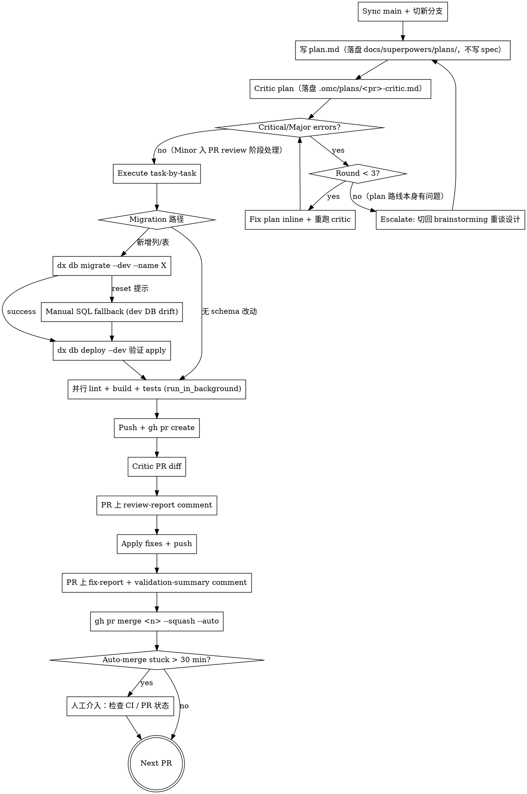

# Multi-PR Feature Delivery

## Overview

按 **复杂度分级** 决定形态：简单改动直接一个 PR 收尾，不写文档不分 PR；复杂改动才写实施计划、走严苛 plan critic、按数据流分多 PR。**收口只有一种姿势：每个 PR 都用 `git-pr-ship` 交付并自动合并到 main**。

> 核心原则：文档只为复杂度服务，不为流程服务。简单的事不要套大流程；复杂的事必须严审拆分。

## Scope

显式调用本 skill 后，**第一步永远是 Step 0 复杂度评估**，由评估决定后续走 Track A / B / C。

适用范围：

- 一个 issue / 需求落地，涉及 1 个或多个层次的改动。
- 用户明确要求决定单 PR / 多 PR、PR train、schema 迁移分批或完整 ship 流程。
- 用户不确定要不要拆 PR，并显式要求使用本 skill 评估。

**不要用：** 用户未显式调用本 skill 时，不要因为需求涉及 PR、migration、dev DB drift 或 feature delivery 自动进入本流程；与代码无关的纯讨论 / 纯文档润色 / 单文件 typo 也不需要本 skill。


## Step 0：复杂度评估闸门（必跑，不可跳）

进入本 skill 后，第一件事不是动代码、不是写文档，而是**对照下表打勾**，给出 Track 判定。**不允许凭感觉直接进入 Track C**。

### 评估维度

逐项判定，每条单独打勾：

| # | 维度 | 计为"复杂"的判据 |
|---|------|-----------------|
| D1 | **改动层数** | 同时改 ≥3 个：Prisma schema / backend service / frontend / admin-front / seed / RBAC / api-contracts |
| D2 | **数据流跨越** | 存在"写入方 → 消费方"两侧改动，且消费方运行期依赖写入方先产生数据（scheduler / cron / 队列消费者 / event handler） |
| D3 | **Schema 变更** | 新增/修改 Prisma 模型（新表、新列、外键、索引），且有运行期消费者 |
| D4 | **新独立模块** | 新建 NestJS module / 新前端 page route / 新 admin 菜单（≥1 个全新顶层目录） |
| D5 | **基建改动** | 改 RBAC enum / ErrorCode / 全局拦截器 / Module DI 拓扑 / 共享 helper（影响多个模块） |
| D6 | **预估改动量** | 按经验估算 diff > 400 行 或 > 8 个文件 |
| D7 | **测试基建** | 需要新增 E2E fixture / 通用 helper 给后续 PR 复用 |
| D8 | **不可逆/高风险** | 数据回填脚本 / 破坏性 migration / 影响生产已有数据 |

### Track 判定

按"命中条数"路由（命中 = 该维度判为"复杂"）：

| 命中条数 | Track | 形态 |
|---------|-------|------|
| **0 条** | **Track A — 直接交付** | 不写文档、不分 PR；改完直接调 `git-pr-ship` 收口 |
| **1-2 条**（且 D2/D3/D8 均未命中） | **Track B — 单 PR + 轻量计划** | 仅写实施计划（无需 spec），critic 一轮，单 PR 走 `git-pr-ship` |
| **≥3 条** 或 **D2/D3/D8 任一命中** | **Track C — 多 PR train** | 写实施计划 + 严苛 critic（≤3 轮） + 按数据流拆 PR + 每个 PR 用 `git-pr-ship` 串行交付 |

> ⚠️ **D2 / D3 / D8 是"硬升级条件"**：只要任一命中，无论总命中数多少，必须进 Track C。原因：数据流跨越无哨兵会上线读 NULL；schema + 消费者不分批会卡 dev DB drift；不可逆变更不分批没法独立回滚。

### Step 0 输出（必须先输出再动手）

```
[复杂度评估]
命中维度：D1=Y D2=N D3=N D4=Y D5=N D6=Y D7=N D8=N（共 3 条）
硬升级触发：无
判定：Track C — 多 PR train
预估 PR 数：3（schema+writer / consumer+DTO / frontend）
```

输出后立刻进入对应 Track，不再回看 Step 0。

---

## Issue Gate（必跑，不可跳）

任何 Track 在切分支前都必须有一个 issue ID。先 `gh issue list --search "<keyword>" --state open` 确认没有已有 issue 可挂；如无则按下表创建。

### Issue 创建时机

| Track | 创建时机 | 原因 |
|-------|---------|------|
| **A** | Step 0 之后、切分支之前 | Track A 无 plan 文档；分支命名 `*/<id>-<slug>` 需 issue ID，commit 末尾 `Refs/Closes: #<id>` 也需要 |
| **B** | 实施计划写完后、plan critic 之前 | plan 落盘后 issue body 引用 plan 路径，形成双向链接；critic 也可参考 issue 范围验证遗漏 |
| **C** | PR 拓扑确定后、Track C-Step 2 plan critic 之前 | 同上；额外好处：issue body 可附 PR 拓扑表，让 reviewer 看清整体 train |

### Issue 模板（必含 4 段）

```markdown
## 背景
（为什么做：用户痛点 / 业务目标 / 触发事件，1-3 段）

## 目标
（做完后达成什么可观测结果，列点。一句话能说清的就一句话）

## 方案
（具体实现路径。Track A 写 1-2 句即可；Track B/C 引用 plan 文档：`详见 docs/superpowers/plans/YYYY-MM-DD-<topic>.md`，可附 PR 拓扑表）

## 验收标准
（必须可勾选：数据/接口/UI/测试覆盖各一条具体可验证项。例如：
- [ ] `User.lastLoginAt` 列存在且 nullable
- [ ] `POST /auth/login` 200 响应后该列被更新
- [ ] ProfileCard 渲染"最近登录：x 小时前"，未登录显示"从未登录"
- [ ] 后端 e2e `auth/login.e2e.ts` 覆盖写入路径）
```

### 创建命令

```bash
gh issue create --title "<title>" --body-file - <<'MSG'
## 背景
...
## 目标
...
## 方案
...
## 验收标准
- [ ] ...
- [ ] ...
MSG
```

创建后记录返回的 issue 号，用于：分支名（`feat/<id>-<slug>`）、commit/PR body 中的 `Refs: #<id>` 或 `Closes: #<id>`。

### 已有 issue 但缺段

如已有 issue 但 4 段不全（多见于他人随手开的 issue），用 `gh issue edit <id> --body-file - <<'MSG' ... MSG` 补齐再继续。**不允许带着不完整 issue 进入实现阶段**——验收标准缺失 = 完成定义不可证。

---

## Track A：直接交付（简单改动）

**适用：** Step 0 命中 0 条。例如：纯前端文案微调、单组件样式修复、单文件 bug fix、配置项调整。

**流程**（不写任何文档）：

1. **Issue Gate**：`gh issue list` 查是否已有；无则按 Issue 模板用 `gh issue create` 直接建（4 段：背景/目标/方案/验收标准）。Track A 的"方案"段写 1-2 句即可。
2. 切分支 `fix|feat|chore/<id>-<slug>` 修改代码
3. `dx lint` + 受影响构建/测试（按改动范围最小化）
4. 直接调用 `git-pr-ship` skill 收口（commit / push / 创建 PR / critic / fix-report / `--squash --auto` 自动合并到 main）。PR body 末尾带 `Closes: #<id>`

**禁止：** 写 spec.md、写 plan.md、跑 plan critic、做 PR 拆分讨论。**这些动作对简单改动是纯粹的开销。**

Track A 完成判据：PR 已 `--auto` 设定且 CI 绿后会自动 merge to main。无需人工 babysit（除非 auto-merge stuck > 30 min，按 Hard Gates 处理）。

---

## Track B：单 PR + 轻量计划（中等改动）

**适用：** Step 0 命中 1-2 条且 D2/D3/D8 均未命中。例如：单模块新增一个 endpoint（无 schema 变更）、前端新增一个 page 复用现有 API、admin 新增一个管理操作。

**流程**：

1. 落盘实施计划：`docs/superpowers/plans/YYYY-MM-DD-<topic>.md`（**不写 spec**，需求直接来源于对话上下文）
2. 计划用 autospec 的 Task 结构（Files / Steps / Verify / Commit），粒度 2-5 分钟每 Task
3. **Issue Gate**：plan 落盘后立即 `gh issue list` 查重；无则 `gh issue create` 按 Issue 模板创建，"方案"段引用 `docs/superpowers/plans/YYYY-MM-DD-<topic>.md` 路径
4. 派 `oh-my-claudecode:critic` 审一轮：仅审 import 路径真实性 / 路由冲突 / DTO 签名 / 遗漏覆盖；critic 报告落盘 `.omc/plans/<topic>-critic.md`
5. **错误必修，遗漏必补**；建议级酌情。允许只跑一轮（中等改动不强制 ≤3 轮上限）
6. 切分支 `feat/<id>-<slug>`，按计划 task-by-task 执行（推荐 `superpowers:subagent-driven-development`）
7. 并行 lint + build + tests
8. 调 `git-pr-ship` 收口，单 PR `--squash --auto` 合并到 main，PR body 带 `Closes: #<id>`

**禁止：** 写 spec 文档（issue body 已足够）、做 PR 拆分（单 PR 即可）。

---

## Track C：多 PR train（复杂改动）

**适用：** Step 0 命中 ≥3 条 或 D2/D3/D8 任一命中。

### Track C-Step 1：撰写实施计划（不写 spec）

> ⚠️ **重要变更**：本 skill 历史版本要求先写 spec.md 再写 plan.md。**实操中 spec 与 issue body 大量重复，沦为格式负担**。新版本只写实施计划，需求直接来自 issue body / 当前对话上下文；如果 issue body 信息不够，回到 `superpowers:brainstorming` 把设计补齐再回来，**不要靠 spec 兜底**。

落盘路径：`docs/superpowers/plans/YYYY-MM-DD-<topic>-multi-pr.md`

计划结构必须包含：

```markdown
# <功能名> Multi-PR Implementation Plan

**Goal:** 一句话
**Track:** C
**Total PRs:** N（来自 Step 0 预估）
**Issue:** #<id>

## PR 拓扑（按硬依赖拓扑序）

| # | PR 标题 | 涵盖层 | 依赖 PR | 是否需哨兵 |
|---|---------|--------|---------|-----------|
| 1 | feat: schema + writer | Prisma + scheduler | - | 是（消费者 PR 前需贴 SQL 证据） |
| 2 | feat: consumer + DTO | service + api-contracts | #1 | 否 |
| 3 | feat: frontend | Next.js | #2 | 否 |

## PR-N Detail（每个 PR 独立一段）

### PR 1: feat: schema + writer
**Files:** Create / Modify 列表
**Tasks:** 同 autospec 的 Task 格式（每步完整代码、Verify、Commit）
**Sentinel:**（如需）哨兵 SQL 查询模板
```

**Issue Gate**：上述 plan 与 PR 拓扑表写完后，立即 `gh issue list` 查重；无则 `gh issue create` 按 Issue 模板创建，"方案"段附 PR 拓扑表 + plan 文档路径。记录 issue 号供所有 PR 分支命名 (`feat/<id>-<slug>-pr<n>`) 与 PR body 引用 (`Refs: #<id>` / 末 PR `Closes: #<id>`)。

### Track C-Step 2：严苛 plan critic（≤3 轮）

派 `oh-my-claudecode:critic`，审核要点：

1. PR 拓扑序是否符合"硬依赖拓扑序"——上游 PR 合并后系统不破？
2. 是否有 PR 把"写入方 + 消费方"塞进同一个？（违反 D2 规则）
3. Schema PR 是否独立？是否带哨兵 SQL？
4. 每个 PR 是否可独立 review / 独立合并 / 独立回滚？
5. Import 路径、Zodios 方法名、DTO 签名是否真实存在
6. 是否遗漏 ErrorCode / Swagger / RBAC / api-contracts / 菜单注册 / Seed
7. 测试基建（fixture / helper）放在第几个 PR，时序合理否

每轮 critic 落盘 `.omc/plans/<topic>-multi-pr-critic-roundN.md`，PR body 引用。

**Hard Gate：** Critical / Major 必修；3 轮仍未过 → escalate 回 `superpowers:brainstorming` 重谈设计。**不允许"接受 minor 妥协"强行通过。**

### Track C-Step 3：按 PR 序列循环交付

对计划中每个 PR，依序执行：

1. `git checkout main && git pull && git checkout -b <branch-pattern-with-issue-id>`
2. 按 PR-N detail 的 Tasks 执行（推荐 `superpowers:subagent-driven-development`）
3. Migration 路径（如有）：`dx db migrate --dev --name X` → 失败走 Manual SQL fallback → `dx db deploy --dev` 验证
4. 并行 lint + build + tests（`run_in_background`，见 Quick Reference）
5. **如本 PR 是写入侧**：等真实写入路径跑过一次，记录哨兵 SQL 输出到下一个 PR 的 body
6. 调 `git-pr-ship` 收口（commit / push / `gh pr create` / critic PR diff / 双 comment / `gh pr merge --squash --auto`）
7. **等 PR-N 真正 merge 到 main 后**才开始 PR-(N+1)（auto-merge stuck > 30 min 人工介入）

> ⚠️ **每个 PR 都必须以 `git-pr-ship` 收口**——不允许某个 PR 跳过 critic 直接 merge，也不允许手动 `--squash` 绕过 CI。`--auto` flag 是自动合并到 main 的唯一合法姿势。

### Track C 拆解原则参考

PR 数量不固定（常见 2-6 个，按 issue 实际形态决定）。拆解时按以下顺序回答四个问题：

### Step 1：列出所有"切面变更"

把 issue 落到具体改动点上，用以下维度横向扫一遍。**有则列，无则跳**：

- **Schema** — Prisma 模型新增/改列、新表、外键、索引
- **数据写入路径** — calculator / scheduler / cron / 队列消费者 / event handler
- **数据读取路径** — DTO、service、controller、API endpoint、api-contracts 重生成
- **独立子模块** — 排行榜/通知/计费/审核 等可单独下线的 feature surface
- **客户端** — 前端组件重写、移动端、新页面、装配处透传
- **管理端** — admin 页面、admin menu seed、ADMIN_PERMISSION 注册
- **基建** — RBAC enum / ErrorCode / Exception / 全局拦截器 / 中间件
- **运营脚本** — seed、迁移工具、回填脚本

### Step 2：识别"硬依赖边界"

PR 之间的依赖通常来自：

1. **数据可用性依赖**：消费方需要写入方先跑过。例如 scheduler 填充列 → 聚合 service 读列；消息队列出现 → consumer 处理。**这是最强的拆分理由**。
2. **API 契约依赖**：前端依赖 zodios schema 发布；admin-front 依赖 admin endpoint 上线。
3. **DI/Module 依赖**：A 模块的 service 注入需要 B 模块先 export；新建模块需先注册到 app.module。
4. **测试基建依赖**：新增 helper / fixture 给后续 PR 用。

> ⚠️ **数据流跨越规则优先于行数门槛**：只要"写入方"和"消费方"两侧都改了，且消费方的运行依赖写入方先产生数据，就必须分离成两个 PR——行数多少、改动是否简单都不是借口。**反过来，如果两侧无运行期依赖（例如纯查询型读法直接查 schema 字段），即使 schema 改了也可一次提交。**

### Step 3：按"硬依赖拓扑序"排出 PR 序列

每个 PR 应满足：

- **可独立 review**：reviewer 不需要前后翻其他 PR 也能判断对错
- **可独立合并**：合入主干后系统不破（即便后续 PR 还没合）
- **可独立回滚**：单独 revert 不会留下半截状态

切分时优先把"基础设施"放在最前（schema 迁移 / RBAC / ErrorCode / 共享 helper），把"叶子节点"放在最后（admin 页面 / 移动端 / 运营脚本）。

### Step 4：决定是否需要"等待哨兵"

凡是涉及**异步写入路径**（scheduler / cron / 队列），**写入侧 PR** 与**消费侧 PR** 之间应等真实写入路径跑过至少一次再合下游。消费 PR 的 PR body 应附一段可复现查询，证明数据已被写入预期形态：

```
SELECT count(*) AS rows,
       count(*) FILTER (WHERE <new_column> IS NOT NULL) AS populated,
       max(<updated_at_column>) AS last_run
FROM <new_or_extended_table>
WHERE <time_filter_matching_writer_cadence>;
```

不允许写"待写入路径跑后再补"——必须先观察真跑过再开消费 PR，避免聚合/查询 service 上线后一直读到 NULL/0。**纯同步读（直接查 schema 字段）不需要哨兵。**

### 常见序列示例

不强制套用，仅作参考：

- **典型 backend-heavy feature**：①schema migration + writer signature → ②consumer service + DTO + api-contracts → ③前端消费 → ④admin 页 + menu seed
- **纯前端 + DTO 微调**：①后端 DTO + api-contracts → ②前端消费（2 PR 即可）
- **大型独立模块加入**：①schema → ②基础设施（RBAC/ErrorCode/共享 helper）→ ③模块本体 → ④消费方接入 → ⑤前端 → ⑥admin（6 PR）
- **重构无新数据**：按"原子可回滚"切片，没有 schema → 也就没哨兵约束

## Per-PR Cycle（仅 Track B / C 适用；Track A 不进此环）



## Hard Gates（不可跳过）

1. **Track 闸门** — Step 0 必须输出 Track 判定后才进入对应路径。Track A 命中 0 条且无硬升级；Track B 命中 1-2 条；命中 ≥3 条 或 D2/D3/D8 任一命中必进 Track C。**不允许"看上去简单"直接跳过 Step 0**。
2. **Issue Gate** — 任何 Track 切分支前必须有 issue ID。创建时机：Track A 在 Step 0 后 / Track B 在 plan 落盘后 / Track C 在 PR 拓扑确定后；4 段不可缺（背景/目标/方案/验收标准）。已有 issue 但段不全要 `gh issue edit` 补齐再继续。**验收标准缺失 = 不允许进入实现阶段**。
3. **Plan critic gate**（Track B / C）— 没有通过 plan critic 的 commit 不得 push。critic 输出落盘 `.omc/plans/<pr>-critic.md`（C 走 multi-pr 命名），PR body 引用该路径让 reviewer 可查。Track A 不需要 plan critic（依赖 `git-pr-ship` 内的 PR diff critic 兜底）。
4. **PR0 哨兵 gate**（Track C 且涉及异步写入路径）— 写入侧 PR 合并并真实跑过一次后，消费侧 PR 必须贴 SQL 查询证据；伪造日志/截图无效。
5. **双 comment gate** — 每轮 PR critic 必须发 **两条** 评论：`review-report`（issue table）+ `fix-report`（修复+拒绝 table）。**为什么不能合并：** reviewer 用 review comment 决定 approve 与否，用 fix comment 验证落实；合并 = 二次 review 必须重读 diff，丧失意义。该 gate 由 `git-pr-ship` 强制执行，本 skill 不允许覆盖。
6. **Critic 上限**（Track C）— 同一 PR plan critic 最多 3 轮。第 3 轮仍有 Critical/Major → escalate 到 `superpowers:brainstorming` 重新谈设计，**不允许"接受 minor 妥协"强行通过**。
7. **统一收口 gate** — 任何 Track 的最终交付动作只能是 `git-pr-ship` + `gh pr merge --squash --auto`。**禁止**手动 `gh pr merge --squash` 不带 `--auto`、**禁止** `--admin` 越权合并、**禁止**绕过 CI。

## Critic 决策矩阵

| 严重级 | 默认决策 | 例外 |
|--------|---------|------|
| **Critical** | 必修 | 无 |
| **Major** | 修，除非有书面 out-of-scope 理由 | 转 follow-up issue |
| **Minor** | 修复 if < 5 行；否则附理由拒绝 | 不允许"超出本 PR 范围"作为唯一理由 |
| **What's Missing** | 转 follow-up issue 或纳入拒绝理由 | 历史遗留可拒绝但需明示 |

每条拒绝必须有具体理由（不接受"留 follow-up"作为通用借口）。

## 双 comment 模板

**Review report**（critic 后立即发）：

```
## 审核报告（第 N 轮）
### 概要：Critical X / Major Y / Minor Z
### Critical 问题（表）
### Major 问题（表）  
### Minor 问题（表）
### 处理决策：逐条标 修/拒（拒绝附 ≥1 句理由）
### 验证流水线（lint/build/test/migration grid）
```

**Fix report**（push 后立即发）：

```
## 修复报告（第 N 轮）
### 已修复（# / 问题 / 修复方式 / commit SHA）
### 拒绝修复（# / 问题 / 理由）
### 统计：总 / 已修 / 拒绝
## ✅ 验证总结（最终验收 grid）
```

## Manual Migration Fallback

`dx db migrate --dev --name X` 报 "dev DB drift / reset" 时：

```bash
# 1. 创建迁移目录（仿现有 migration 命名）
TS=$(date -u +%Y%m%d%H%M%S)
mkdir -p apps/backend/prisma/schema/migrations/${TS}_<name>

# 2. 手写 migration.sql（参考已存在的 migration 文件抄格式）
#    必含：-- AlterTable / -- CreateTable / -- AddForeignKey 注释块 + ROLLBACK 参考

# 3. 应用迁移
dx db deploy --dev

# 4. 验证（生成 client + 类型 check）
dx db generate
pnpm type-check:backend
```

> 📝 **`dx db reset --dev` 是 dev 环境允许的合法操作**，但建议作为最后手段：reset 会清空 dev DB 中其他在途分支的 seed/手测数据，影响队友。优先级排序：
> 1. **Manual SQL fallback**（已展示，零破坏，推荐）
> 2. `dx db migrate --dev --name X`（标准路径，如未触发 reset 提示）
> 3. `dx db reset --dev` + `dx db deploy --dev` + `dx db seed --dev`（在已与队友确认或 dev DB 已脏到难以挽救时使用，需提前在团队频道周知）
>
> 生产 / staging 环境的 reset 是禁止的。

## 并行 Verify

```bash
# 三个独立 run_in_background Bash 调用，记录 task IDs（每次 run_in_background
# 工具会返回 ID，主控用它去读 output 文件）
# 等待方式优先 use SYSTEM 自动通知（每个 background 完成时 task-notification
# 会到达），不要写本地 pgrep 等待循环——dx 实际 spawn 的进程名不一定匹配
# 'nx.js'，pgrep 可能漏判或永等。

# 兜底方式（仅在通知机制不可用时）：
deadline=$(($(date +%s) + 1800))   # 30 分钟硬超时
until [ -z "$(pgrep -f 'nx (lint|build|test|run-many|affected)' 2>/dev/null)" ]; do
  [ "$(date +%s)" -ge "$deadline" ] && { echo "TIMEOUT"; exit 1; }
  sleep 5
done
# tail 各任务 output 文件验证 exit 0
```

> **为什么不能串行**：lint 失败时 build/test 仍提供独立信号；串行会在 lint 报错时屏蔽后续问题，反而增加 fix-rebuild-rerun 循环次数。3 信号并发收敛 = 单次循环修干净所有维度。

## Quick Reference

| 操作 | 命令（可直接 copy-paste） |
|------|---------------------------|
| 查 issue | `gh issue list --search "<keyword>" --state open` |
| 创建 issue | `gh issue create --title "..." --body-file - <<'MSG' ... MSG`（必含 4 段：背景/目标/方案/验收标准） |
| 补全 issue | `gh issue edit <id> --body-file - <<'MSG' ... MSG`（4 段缺失时强制补齐） |
| 切 PR 分支 | `git checkout main && git pull && git checkout -b feat/<id>-<slug>` |
| Critic plan | `Task` tool（即 `Agent` 工具）with `subagent_type: oh-my-claudecode:critic`（critic 是 agent 不是 skill；harness 里入口名通常叫 `Agent` 或 `Task`，等价） |
| 手动迁移 | `mkdir -p apps/backend/prisma/schema/migrations/$(date -u +%Y%m%d%H%M%S)_<name>` |
| 应用迁移 | `dx db deploy --dev` |
| 并行 verify | `dx lint &`、`dx build affected --dev &`、`dx test unit ... &` 各起一个 `run_in_background` Bash |
| 创建 PR | `gh pr create --base main --title "..." --body-file - <<'MSG' ... MSG` |
| 合并 PR | `gh pr merge <num> --squash --auto`（**不要** fallback 到 `--squash` 直接合，那会绕过 CI） |
| 关闭 issue | `gh issue edit <id> --body-file -` 重写 body 勾选 + 加 PR 链接 |

## Common Mistakes

| 错误 | 加固 |
|------|------|
| 把 schema + DTO + frontend 塞进一个 PR | 数据流跨越规则优先于行数 |
| 跳过 PR0 哨兵 SQL 证据 | 无证据 = 拒绝 review；伪造可被一查发现 |
| 跳过 plan critic | Hard gate：critic artifact 必须落盘并在 PR body 引用 |
| 把 review + fix 合并成一条 comment | 双 comment gate（详见 Hard Gates §3） |
| 串行 lint→build→test | 并行 3 路独立信号 |
| 第一反应就 `dx db reset --dev` | reset 是 dev 环境允许的，但属于最后手段；优先 manual SQL fallback；如确需 reset，先告知队友再操作 |
| 第 3 轮 critic 仍未过强行 minor 妥协 | 必须 escalate 回 brainstorming，不允许折中 |
| `gh pr merge --squash --auto \|\| --squash` 短路 fallback | 失败必须人工介入，不绕过 CI |
| 简单改动也套 plan + critic + 多 PR | Step 0 命中 0 条直接走 Track A，不写文档不分 PR |
| 跳过 Step 0 凭感觉判定 Track | Step 0 输出是 Hard Gate 1，必须先打勾给数 |
| 用户说"简单 / 不要搞复杂 / 30 分钟内交付"就直奔 Track A | 用户表达的是**舒适度诉求**，不是**Track 判据**；判据只看 D1-D8 命中。30 分钟做完一个 Track C 是可能的（多 PR 不等于多周），不要把"快"等价于"少 PR" |
| 没 issue 直接切分支开干 | Hard Gate 2：任何 Track 切分支前必须有 issue ID + 4 段齐全；分支命名 / commit / PR body 都依赖它 |
| Issue 只有标题或一句话描述就当合格 | 缺背景/目标/方案/验收标准任一段就 `gh issue edit` 补齐；验收标准列点必须可勾选 |
| Track B/C 在写 plan 之前先创建 issue | 时序错：plan 决定方案与 PR 拓扑，issue body "方案"段需要引用 plan 路径 / PR 拓扑表，反过来不成立 |
| "只是加一个字段，schema 改动是简单的" | D3 是硬升级条件，**schema 改动一律进 Track C**——单字段也要分 PR，原因是 dev DB drift / 独立 rollback / api-contracts 时序 |
| 用 "schema 自己就是文档" 替代实施计划 | Schema diff 不是 plan：plan 包含拓扑序、哨兵、import 路径、Verify 步骤，schema 不含这些 |
| Track C 漏写 spec | 新版本不写 spec，需求来源于 issue body / 对话；信息不够回 brainstorming |
| 单 PR `--squash` 直接合（不带 `--auto`）| 必须 `--squash --auto` 走 CI 后自动合并到 main |
| auto-merge 挂 30 分钟无人管 | 流程图节点要求超时人工介入 |

## Tie-In With Existing Skills

- `superpowers:brainstorming` — 首 PR 设计阶段（PR1 前）使用；critic escalate 时回到此
- `autospec` — 单 PR 内的 spec→plan→execute 自动化；本 skill 在多 PR 之上调度它
- `git-pr-ship` — 单 PR 的 review→fix→ship 收尾流程
- `oh-my-claudecode:critic` agent — 通过 `Task` tool 调度（注：是 agent 不是 skill，无 `Skill` 工具入口）

## Limitations

本 skill 基于 issue #4774 单次实战抽象，未做结构化计时与多场景 baseline。新执行者首次使用时建议：

1. 跑完后向 issue body 追加"实施回顾"段：实际几轮 critic、几个 manual migration、auto-merge 是否 stuck
2. 若发现新 rationalization（绕过哨兵 / 跳 critic / 折中 minor），回到本 skill 用 `superpowers:writing-skills` RED-GREEN-REFACTOR 加固
3. Real-world impact 数据（PR 数 / 时长 / 回滚次数）需要多次实战采样后再写入"成绩"段
